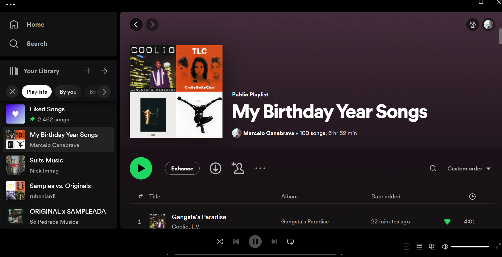

# billboard-to-spotify
The goal of this repository is to create a web scrapping application to get data from Billboard and use this data to create a custom playlist via Spotify API.

## Instructions

1. Install requirements: spotipy is a key library for this project to simplify authentication and authorization as it makes it easy to make requests to the Spotify API. 
2. Fill in your spotify_template config variables after creating your developer account and application in the Spotify Dev Portal.
3. Run the notebook and follow the remaining instructions inside of it.

## Enjoy your new playlist

Now that my playlist was created successfully, I'll turn my computer off and enjoy what my hard work has gifted me with.

## Next steps

In the future, I intend to add another notebook using Spotify API directly to manually handle Authentication and improve my understanding of their API.
